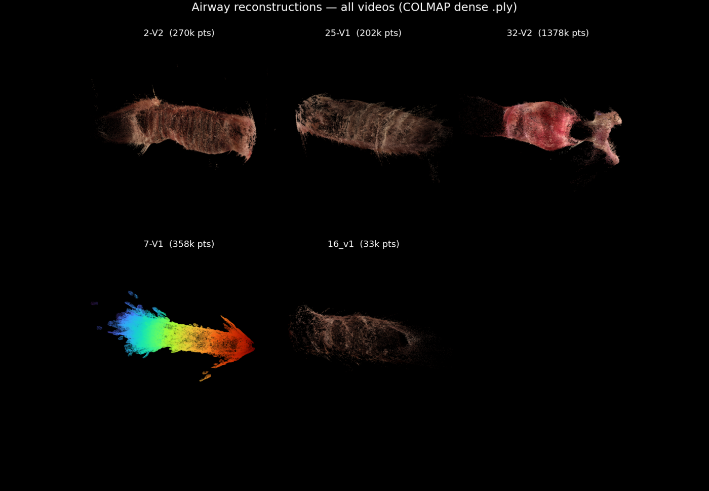

# bronchotrust — Barbour-style COLMAP airway reconstruction (baseline)

Monocular pediatric-airway (bronchoscopy/laryngoscopy) 3D reconstruction and
**scale-free % obstruction** measurement from clinical video, using COLMAP
Structure-from-Motion + Multi-View Stereo with **smart local-batch frame selection**.

This tag (`barbour-style-colmap-baseline`) is the frozen, working COLMAP baseline. It is a
research feasibility pipeline, **not** a validated clinical tool — see
[Known limitations](#known-limitations).

> The next method (texture-free silhouette/shading lumen fitting, using COLMAP poses only as
> initialization) is scoped separately in [`NEW_METHOD_SCOPE.md`](NEW_METHOD_SCOPE.md).

---

## Pipeline overview

```
video ─► smart frame selection ─► COLMAP SfM (pinned intrinsics, exhaustive)
      ─► dense MVS ─► airway point cloud ─► medial-axis centerline
      ─► perpendicular cross-sections ─► CSA / DCE per ring
      ─► (one connected model) scale-free % obstruction
```

Two things learned the hard way, baked into the design:

- **Frame SELECTION is the decisive lever.** Naive contiguous 30-frame windows fail the
  low-texture subglottis; *smart* selection — CLAHE + sharpness/glare/contrast gating +
  viewpoint-coverage-diversity sampling + adaptive pool (±30 → ±20 → ±45) — closes clean
  subglottic ring **shapes** where naive windows cannot (8/12 landmarks accepted;
  proximal subglottis 3/3 reproducible across videos).
- **COLMAP nails poses; the dense wall is the weak link.** Feature-SfM/MVS needs texture, and
  the airway wall is textureless/specular. Rings are measured on the **dense MVS cloud**
  (not the Poisson mesh), sliced **at centerline points** (a forward scope images the wall
  *ahead* of itself), with three CSA estimators that must agree.

### Locked design decisions
Intrinsics are **pinned, never refined** (OPENCV model, `ba_refine_*=0`); calibration gives
intrinsics **not** transferable scale; measure on the **dense cloud**; slice at **centerline
points**; **% obstruction = area ratio** (scale-invariant — the primary deliverable); no SfM
matcher overcomes low parallax (GlueMap was A/B-tested and rejected). See `CLAUDE.md`.

---

## Key scripts

| script | purpose |
|---|---|
| `barbour30_smart.py`    | smart 30-frame **selection** (quality gating + coverage-diversity) |
| `barbour_pipeline.py`   | **end-to-end** per (video, landmark): select → COLMAP → MVS → CSA/DCE, adaptive fallback |
| `barbour30.py` / `barbour30_dense.py` / `barbour30_report.py` | sparse screen / dense+measure / report table |
| `batch_dense.py`        | long-window **global** reconstruction (one connected model = one scale) |
| `geometry_debug_32v2.py`/`batch_render.py` | medial-axis centerline, cross-section, organ renders |
| `barbour30_bridge.py` / `barbour30_band.py` | scale-free **% obstruction** (global common scale, stability band) |
| `final_ply_render.py`   | presentation renders from each video's final `.ply` |
| `phantom_test.py` / `phantom_gt_compare.py` | phantom validation (known radius) |

---

## Environment

Two conda envs (heavy, external to this repo):

- **`depth-eval`** — Python driver: `cv2`, `pycolmap` (4.0.4), `open3d`, `numpy` 2.x, `scipy`,
  `matplotlib`. All `barbour30_*.py` scripts run here.
- **`colmap-cuda`** — the `colmap` binary (CUDA MVS), invoked via subprocess.

```bash
pip install -r requirements.txt          # into the depth-eval env
# colmap binary: /home/<you>/.conda/envs/colmap-cuda/bin/colmap
```

Input videos and per-session calibration live **outside** the repo (git-ignored):
`dataset/…` (videos) and `runs/retriage_first15/_calib/<session>/intrinsics_pinned.json`.

---

## How to run — smart local-batch reconstruction

The main entry point runs the whole per-landmark pipeline with the adaptive fragmentation
fallback and strict acceptance (1 connected component **and** closed ring, cov ≥ 60% &
r_std/r_med ≤ 0.35 **and** CSA-estimator spread ≤ 1.3×):

```bash
# all videos × landmarks (glottis / prox-subglottis / dist-subglottis / trachea)
python barbour_pipeline.py --videos 2-V2,25-V1,32-V2 --landmarks glottis,prox_subglottis,dist_subglottis,trachea_ref

# one landmark (fast validation)
python barbour_pipeline.py --videos 25-V1 --landmarks prox_subglottis
```
Per accepted landmark it writes `runs/barbour30/batches/<name>/`: `A_organ_cloud.png`,
`B_centerline.png`, `landmarks.png`, `reproject_check.png`, `measure.json`; and the run
writes `runs/barbour30/pipeline_report.json` + `pipeline_overview.png`.

Supporting steps:
```bash
python barbour_pipeline.py ... ; python barbour30_report.py     # acceptance table
python batch_dense.py --video 2-V2.MP4 --session 2_v2 --lo 870 --hi 1200 --out runs/batch4/2-V2   # global model
python barbour30_bridge.py ; python barbour30_band.py            # scale-free % obstruction + stability band
python final_ply_render.py                                       # presentation renders
```

---

## Current results summary

**Reconstruction (smart pipeline):** 8/12 landmarks **accepted**; **proximal subglottis 3/3**
reproducible across `2-V2`, `25-V1`, `32-V2`. The pipeline **rejects** rather than fakes the
hard cases (fragmentation / open rings / estimator disagreement).

**Scale-free % obstruction** (area ratio, scene units, **no mm**, within-video only):

| video | result | quality |
|---|---|---|
| **2-V2**  | **~33% area (band 24–38%)**, ~18% diameter | clean **monotonic** narrowing — trustworthy |
| **25-V1** | ~24% area (band 21–28%) | **non-monotonic / noisy** — low confidence |
| **32-V2** | not obtainable | global subglottic rings all noisy (r_std/r_med 0.43–0.91) |

So a trustworthy scale-free % is reliable on **1 of 3 videos** today.

**Phantom validation:** the pipeline recovers a known tube radius to **1.8%** — errors on real
video are **data-limited, not algorithmic**.

Example figures (in [`docs/figures/`](docs/figures)):
`reconstructions_all_videos.png`, `landmark_rings_by_video.png`, `obstruction_2-V2.png`,
`obstruction_band_2-V2.png`; example reports in [`docs/results/`](docs/results).



---

## Known limitations

- **No absolute mm scale.** Monocular SfM is gauge-free, and no static, non-specular,
  known-size object appears in a connected model with the airway (the Hopkins shaft is a
  *moving, specular* instrument; tube bores/rims are *specular/overexposed* and don't
  reconstruct; the laryngoscope slot is off-screen; the telescope can't self-image). All
  CSA/DCE are **scene units only**. Absolute mm remains **capture-protocol-gated**.
- **No CT-paired validation completed.** The one CT-paired video (`16_v1`) reaches the carina
  and mainstems *visually*, but its slow, dwelling (low-parallax) scope fragments/collapses in
  SfM — no connected model, no recoverable scale — so the CT DCE comparison could not be done.
- **Scale-free % is reliable on only 1/3 videos.** The subglottis (the clinical target) is
  data-limited: low texture, low parallax, and partial angular coverage of the narrowest ring;
  the reference is the *patient's own trachea*, not a normative airway — this is **not** a
  final Myer–Cotton grade.
- **COLMAP MVS is texture-hungry**; clean *pose* recovery does not imply a clean *wall*
  surface. This motivates the next method (`NEW_METHOD_SCOPE.md`).
- Some videos use **borrowed calibration** (e.g., `32-V2` borrows `32_v1`) — provisional.

---

## Required future data (to reach clinical validation)

1. **Same-day paired video + CT** of the same airway, where the bronchoscopy **reaches and
   reconstructs** the CT-measured region (distal trachea / mainstems), so reconstructed DCE can
   be checked against a CT ground truth.
2. **A valid in-frame scale anchor** — a **matte, non-specular, known-size** object (a marked
   probe/ruler, or the laryngoscope aperture deliberately kept in view) held **static** in the
   **same continuous pass** as the airway, so a metric scale can be recovered in one connected
   model.
3. **Per-video camera calibration** — a checkerboard clip from the *same scope and session*
   (several videos currently borrow calibration).
4. **A capture protocol built for photogrammetry** — a steady, **advancing (non-dwelling)**
   scope for parallax; minimize overexposure, specular glare, and mucus at the target region.

---

## Repository notes

Generated outputs (`runs/`), videos, COLMAP databases (`*.db`), MVS workspaces, raw point
clouds (`*.ply`), and model weights are **git-ignored** and regenerable. Only source scripts,
docs, and the lightweight example figures/reports under `docs/` are tracked. See `.gitignore`.
