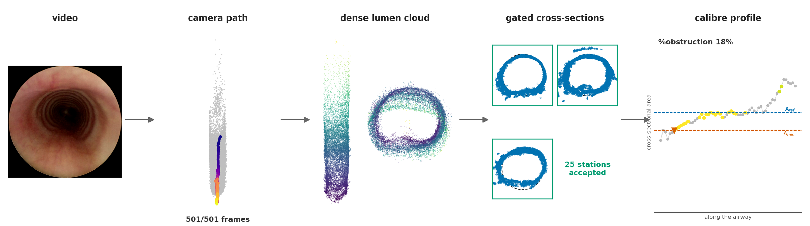
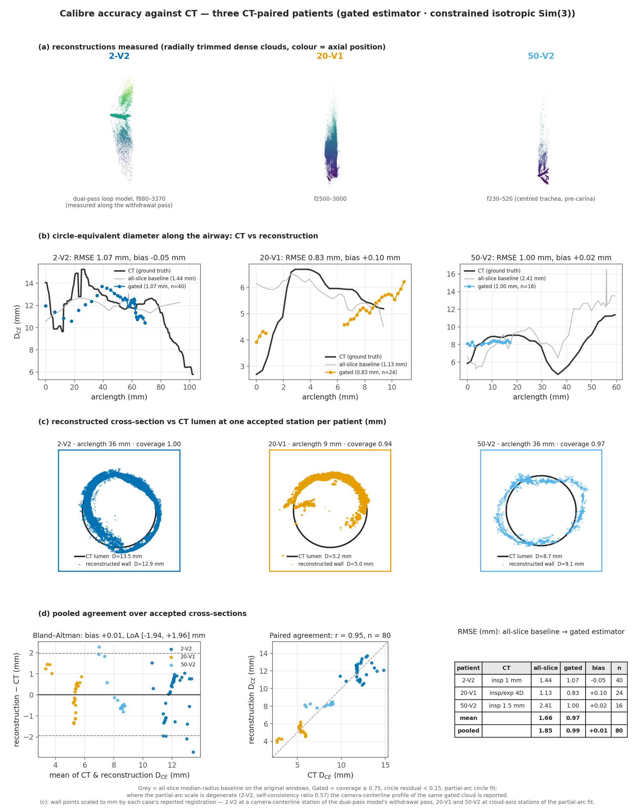

# bronchotrust — CT-validated airway calibre from monocular bronchoscopy video

Monocular paediatric-airway 3D reconstruction and calibre measurement from routine bronchoscopy /
laryngoscopy video. A standard Structure-from-Motion + Multi-View Stereo backbone (COLMAP, pinned
per-session intrinsics) is kept fixed; the contribution is the **gated measurement layer** on top of it,
its **validation against CT**, and a reviewed cohort showing that **capture behaviour, not optics,
decides whether an airway is measurable**.

It is a research pipeline, not a clinical device. Every number it produces comes with the check that
makes it trustworthy (coverage gate, estimator agreement, self-consistency, span guard) and the
pipeline **rejects rather than fakes** when a check fails.



---

## What it does

```
video ─► sequential decode, CLAHE, quality gate ─► frame WINDOW (chosen from a contact sheet)
      ─► COLMAP SfM, intrinsics pinned (never refined), exhaustive matching, fragment bridging
      ─► dense MVS point cloud (no mesh is measured)
      ─► cross-sections perpendicular to the lumen axis: partial-arc circle + ellipse fit
      ─► gates: coverage ≥ 0.75 · circle residual < 0.15 · circle/ellipse agree < 30% · ends excluded
      ─► CSA / D_CE profile ─► scale-free %obstruction = 1 − A_min/A_ref
      ─► (with CT) constrained isotropic Sim(3) registration → absolute calibre in mm
```

Three things learned the hard way and baked into the design:

- **Capture behaviour decides success.** A measurable tube needs the scope to move steadily and
  monotonically through the lumen, centred, without dwelling, reversing, going dark or pressing on the
  wall. Per-frame parallax does not discriminate successes from failures; the traversal does. Whole-video
  statistics (blur, centring, speed) do **not** predict measurability (Spearman ρ = +0.19 / +0.17 / −0.14,
  all n.s., n = 29). Frame-by-frame review does: the failure classes are dynamic wall motion,
  mucosal abnormality, instrument in the field, wall contact / glare, and non-airway footage.
- **Frame selection is the lever you control.** Manual windowing onto a steady centred pass from a
  dense contact sheet roughly doubled the cohort yield and rescued clips that failed on their whole
  traversal (17-V1 by the pullback, 26-V2 by the pass before a wall collapse, 19-V1 by the right window
  plus the right calibration). Nothing else — matchers (GlueMap, MASt3R), masking, deblurring — helped.
- **Poses are reliable, the dense wall is the weak link.** Calibre is measured on the dense MVS cloud,
  sliced at centreline points, and only where the ring closes. A dual-pass (descent + withdrawal) model
  constrains the global scale but thickens the wall; measure along one monotonic pass.

---

## Results (Computerized Medical Imaging and Graphics manuscript, September 2026)

**Feasibility.** 29 paediatric examinations from two clinical batches reconstructed with the same
pipeline: **18 measurable tubes** (3 of them CT-validated), 5 partially measurable, 6 not measurable.
One further patient (19-V1) was rescued after the cohort table was frozen.

**Calibre accuracy against CT** (D_CE at matched arclength, constrained isotropic Sim(3), accepted
cross-sections only):

| Patient | CT | Gated RMSE (mm) | bias (mm) | n | note |
|---|---|---|---|---|---|
| 2-V2 | inspiratory, 1 mm | **1.07** | −0.05 | 40 | dual-pass model, measured along the withdrawal pass |
| 20-V1 | insp.+exp. pair, 1 mm | **0.83** | +0.10 | 24 | tracheobronchomalacia (dynamic case) |
| 50-V2 | inspiratory, 1.5 mm | **1.00** | +0.02 | 16 | proximal trachea, window cut before the carina |
| pooled (3) | | **0.99** | +0.01 | 80 | LoA [−1.94, +1.96] mm, r = 0.95; ungated baseline 1.85 |
| 19-V1 (added) | CTA, 0.6 mm | **0.72** | −0.14 | 16 | ground truth re-derived (see below); 5 windows from 2 endoscopies agree 0.61–0.74 |

**Dynamic airway.** 20-V1's paired inspiratory/expiratory CT shows a 45 % expiratory reduction in
tracheal cross-section (33 → 18 mm²); the reconstruction matches the patent inspiratory phase and the
clinical diagnosis of moderate tracheobronchomalacia was confirmed from the chart.

**Scale-free %obstruction without CT.** On the 16 measurable airways, 11 read ≤ 30 %, the empirical
noise floor (a clinically normal airway reads 29 %); values above it are either flagged by profile CV
> 0.15 or clinically unconfirmed. The CT-normal 2-V2 reads 18 %.

**External check.** The same recipe on the public C3VD benchmark (real endoscope, CT-registered meshes):
median surface accuracy 1.40 mm across 5 sequences, camera-pose residual 0.15 mm; synthetic phantom
radius recovered to 1.8 %.

**Method boundary.** 30-V2 carries a near-occlusive tracheal stenosis. The pipeline reconstructs the
proximal segment the scope can reach (35/48 gated) but every CT fit collapses onto a 4–7 mm sliver; the
**span guard** (mapped length ≥ 10 mm and ≥ 25 % of the CT segment) rejects it. A low RMSE alone is not
a measurement.

Figures: [`docs/figures/`](docs/figures) — CT validation, cohort gallery, capture mechanisms, exemplar
cases, the 26-V2 wall-collapse event, and the 19-V1 rescue. Tables and per-case JSON:
[`docs/results/cmig/`](docs/results/cmig).



---

## Using it on a new video

Full walkthrough in [`docs/NEW_VIDEO.md`](docs/NEW_VIDEO.md). The short version:

```bash
export BRONCHO_COLMAP=/path/to/colmap          # COLMAP 3.13 with CUDA
# 1. per-session intrinsics from the checkerboard clip (14x13 inner corners), pinned in every later step
python pipeline/calibrate.py --video "SESSION Calibration Video.MP4" --out calib/SESSION_intrinsics.json
# 2. contact sheet -> read off the frame window of a steady, centred, monotonic pass
python pipeline/contact_sheet.py --video SESSION.MP4 --out sheets/SESSION.png
# 3. reconstruct that window (SfM + MVS), unchanged recipe
python pipeline/recover_clip.py --video SESSION.MP4 --calib calib/SESSION_intrinsics.json \
       --lo 1040 --hi 1320 --out runs/SESSION_w1 --gpus 0,1
# 4. is it measurable?  (>=20 gated interior stations = measurable tube)
python pipeline/eval_recon.py runs/SESSION_w1
# 5. scale-free calibre profile and %obstruction
python pipeline/measure_csa.py runs/SESSION_w1/dense0/fused.ply --out runs/SESSION_w1/csa.json --plot runs/SESSION_w1/csa.png
# 6. (if a thin-slice CT exists) ground truth, then absolute-mm scoring with all validity rules
python pipeline/ct_ground_truth.py --case SESSION --zip SESSION_CT.zip --out-dir ct_gt
python pipeline/ct_score.py SESSION runs/SESSION_w1 --gt ct_gt/gt_SESSION.npz
```

Several windows at once: put one job per line in a file and run `pipeline/run_queue.sh` (two workers,
two GPUs each, results auto-evaluated). Calibration is **never** borrowed silently; if a session has no
board video, match its endoscope image circle to a calibrated session of the same scope and flag it.

---

## Repository structure

```
pipeline/                 the pipeline: one recipe, applied unchanged to every video
  calibrate.py              checkerboard video -> pinned OPENCV intrinsics (forced 14x13 board, isotropy gate)
  contact_sheet.py          dense contact sheet + brightness / dark-lumen traces for window picking
  recover_clip.py           window -> CLAHE -> SfM (pinned, exhaustive, fragment bridging) -> MVS -> cloud
  eval_recon.py             measurability tiers (gated interior stations, coverage)
  measure_csa.py            gated CSA profile + scale-free %obstruction on one cloud
  ct_ground_truth.py        DICOM -> TotalSegmentator trachea -> D_CE profile (stenosis-aware)
  ct_score.py               reconstruction vs CT: isotropic Sim(3), self-consistency rule, span guard
  run_queue.sh              unattended batch runner (atomic job claiming)
  csa_partialarc.py         partial-arc circle + ellipse cross-section fitting
  airway_analysis.py        shared cloud utilities (cleaning, PCA-aligned renders, registration helpers)
  csa_run.py / render_airway.py / centerline_csa.py / batch_dense.py / barbour_dense_recon.py
  airway_gate.py            universal validity gate (v0 skeleton, see AIRWAY_GATE_DESIGN.md)

experiments/
  cmig_paper/             every figure, table and report of the manuscript (figstyle.py = design system),
                          the CT-3 evaluation (ct3_*.py), cohort yield (gallery_v2.py), capture-behaviour
                          analysis, robust CSA cohort table, calibration table, rescue summary
  porcine/                porcine cohort experiments (4D-CT pending)
  clips/, diagnostics/    per-clip and probe scripts from the development history

evaluation/               CT-ground-truth harness (registration, metrics, GroundTruth container)
direct_metrology/, redteam_phase0/, photometric_pivot/   recorded negative results
docs/                     figures, results JSON/tables, NEW_VIDEO.md
```

`runs/` (workspaces, clouds, renders) and the datasets are git-ignored and regenerable.

---

## Environment

- **Python driver** (conda env `depth-eval`): Python 3.11, numpy 1.26, scipy 1.17, opencv 4.13,
  open3d 0.18, pycolmap 4.0.4, matplotlib 3.10, pydicom 3.0, nibabel 5.4, scikit-image 0.26.
  `pip install -r requirements.txt`.
- **COLMAP 3.13 (CUDA)** as a binary: set `BRONCHO_COLMAP`. Post-steps run under `BRONCHO_PY`
  (defaults to the current interpreter).
- **TotalSegmentator** (only for CT ground truth): `python -m venv --system-site-packages ~/.venvs/totalseg
  && ~/.venvs/totalseg/bin/pip install TotalSegmentator "numpy<2"`; set `TOTALSEG_BIN` and
  `TOTALSEG_HOME_DIR` (weights, 1.4 GB, downloaded on first use). Run the full task; the `--roi_subset`
  shortcut under-segments.
- Two ops facts worth knowing: pycolmap and Open3D-CUDA in one process can segfault (the tools parse
  `run.log` instead), and Open3D's EGL renderer fails while COLMAP saturates the GPUs (renders use
  matplotlib).

---

## Known limitations

- **Absolute mm needs a CT.** Monocular SfM is gauge-free and no static known-size object appears in
  the field, so without CT all calibre is in scene units and only ratios (%obstruction) are reported.
- **The reconstruction covers what the scope traverses.** Validated segments span 16–40 mm of trachea;
  a near-occlusive stenosis stops the scope and the case becomes a documented boundary, not a result.
- **Ground truth provenance.** The three published CT cases use the original TotalSegmentator ground
  truth. 19-V1 uses a re-derived ground truth from `pipeline/ct_ground_truth.py`, validated against the
  original on 2-V2 (0.46 mm RMSE, r = 0.99); on 50-V2 the two derivations differ by about 1 mm, so the
  two sets are reported separately.
- **Borrowed calibrations** (16-V1 from 2-V2, 32-V2 from 32-V1, 28-V2 from 20-V1) are flagged in the
  calibration table; 70-V2 matches no cohort scope and is excluded.
- Some legacy experiment scripts keep machine-specific dataset paths; the `pipeline/` tools do not.
